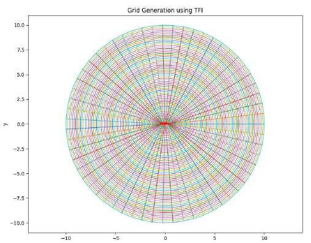
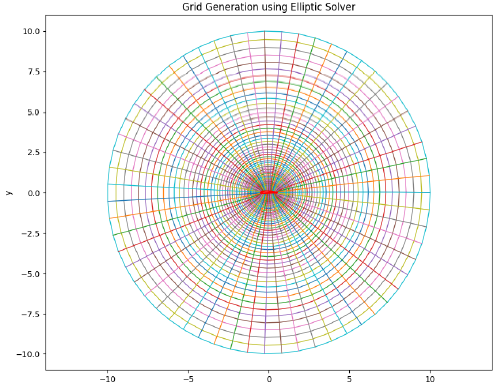
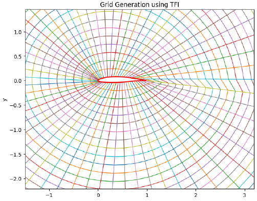
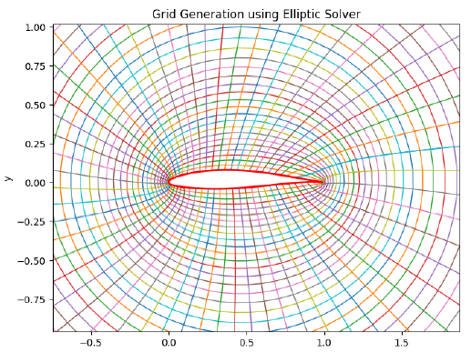

# 2D Structured Grid Generation for a NACA 63-412 Airfoil (TFI + Elliptic Smoothing)

A from-scratch Python implementation of two classical structured mesh generation techniques — Transfinite Interpolation (TFI) and Elliptic Grid Generation — applied to build a computational grid around a NACA 63-412 airfoil for CFD preprocessing.

---

## 1. What this project does

Before any CFD solver can compute a flow field, the physical domain has to be discretized into a mesh. For structured grids, that discretization is itself a nontrivial numerical problem: naive interpolation between boundaries produces a grid that touches every boundary correctly but can be skewed and poorly spaced in the interior, which degrades solver accuracy.

This project implements, from first principles, the two-stage approach commonly used to address that:

1. **Transfinite Interpolation (TFI)** — a fast algebraic method that builds an initial grid purely by interpolating between four boundary curves. Cheap to compute, but offers no control over interior grid quality (orthogonality, smoothness).
2. **Elliptic Grid Generation** — takes the TFI grid as an initial guess and smooths it by iteratively solving a coupled pair of Poisson equations for the interior point coordinates, trading computational cost for much better grid quality (smoother spacing, more orthogonal grid lines near the body).

The airfoil surface itself is first read from raw digitized coordinates and smoothed with a cubic spline before either grid method is applied.

---

## 2. Methodology

### 2.1 Airfoil geometry preparation
Raw NACA 63-412 coordinates (in mm) are loaded from CSV, cleaned of any non-numeric rows, scaled to a unit-chord airfoil, and closed (the first point is appended to the end if the curve isn't already closed). A cubic spline is then fit through the parametrized coordinates and resampled to `NX` points, giving a smooth, evenly-parametrized airfoil surface to use as a grid boundary — the raw digitized points alone are not evenly spaced enough to use directly as a grid boundary.

### 2.2 Transfinite Interpolation
The computational domain is mapped to a unit square in (ξ, η), with the airfoil surface as one boundary and a circular far-field boundary (radius = 10 chords) as the other. Grid points are computed as the standard TFI blend of the four boundary curves, minus the bilinear correction term that keeps the four domain corners consistent:

```
X(ξ,η) = (1−η)·X_bottom(ξ) + η·X_top(ξ) + (1−ξ)·X_left(η) + ξ·X_right(η) − [bilinear corner correction]
```
(and equivalently for Y).

### 2.3 Elliptic Grid Generation
The TFI grid is refined by solving the elliptic grid-generation PDE system:

$$\alpha X_{\xi\xi} - 2\beta X_{\xi\eta} + \gamma X_{\eta\eta} = 0$$
$$\alpha Y_{\xi\xi} - 2\beta Y_{\xi\eta} + \gamma Y_{\eta\eta} = 0$$

where the metric coefficients α, β, γ are recomputed from the current grid at every iteration:

$$\alpha = x_\eta^2 + y_\eta^2, \qquad \beta = x_\xi x_\eta + y_\xi y_\eta, \qquad \gamma = x_\xi^2 + y_\xi^2$$

The system is discretized with second-order central differences and solved with a Gauss-Seidel-style point relaxation sweep, iterating until the largest coordinate change between successive iterations drops below a tolerance (here, 1×10⁻³). The airfoil surface and far-field boundary are held fixed (Dirichlet conditions) throughout; the domain is treated as periodic in ξ (the grid wraps fully around the airfoil), which is enforced explicitly by copying the first ξ-row of the grid onto the last row after every sweep, and by using wraparound neighbor indexing (`[-2, j]`) at the ξ = 0 seam.

---

## 3. Results

**Convergence:** the elliptic solver reduced the maximum coordinate change from 0.0478 (iteration 0) to below the 1×10⁻³ tolerance at **iteration 2,121**, taking 2,122 relaxation sweeps to converge on a 60×60 grid. Full per-iteration convergence history is in [`run_log.txt`](run_log.txt).

### 3.1 Full-domain grids

<p align="center">
<br>
<em>TFI grid — full domain (far-field radius = 10 chords)</em>
</p>

<p align="center">
<br>
<em>Elliptic-smoothed grid — full domain</em>
</p>

### 3.2 Detail near the airfoil

<p align="center">
<br>
<em>TFI grid, zoomed to the airfoil — grid lines conform to the surface but are visibly
skewed and non-orthogonal near the leading and trailing edges</em>
</p>

<p align="center">
<br>
<em>Elliptic-smoothed grid, same zoom — grid lines meet the airfoil surface far more
orthogonally, and cell size transitions more gradually outward</em>
</p>

The zoomed comparison is the clearest evidence of what the elliptic step actually buys: the TFI grid lines fan out from the leading/trailing edges at oblique, unevenly-spaced angles, while the elliptic grid lines cross the surface at close to 90° and space out much more evenly — exactly the orthogonality and smoothness improvement the elliptic PDE system is designed to produce.

---

## 4. Grid topology

The accompanying project report describes this as a **C-grid**, which is the standard topology choice for airfoil grids (it opens a wake-cut branch downstream of the trailing edge, giving a clean rectangular computational domain with independent inner/outer boundary treatment). **Looking at the actual code and the resulting plots, what's implemented here is an O-grid**, not a C-grid: the far-field boundary is swept through a full 2π (`x_top = radius·cos(2πξ)`, a complete circle, not a semi-circle), the airfoil boundary is likewise treated as a closed periodic loop, and the code explicitly enforces periodicity at the ξ = 0/1 seam (`X_new[-1,:] = X_new[0,:]` and wraparound neighbor indexing) rather than defining a wake-cut branch line. The two side "boundaries" (A/B and C/D corners) also collapse to the same point pairs rather than defining distinct wake-cut edges, consistent with an O-grid rather than a C-grid.

This isn't a flaw — O-grids are a legitimate and commonly used topology for airfoil meshing, especially for simpler inviscid or moderate-Reynolds-number studies — but it's worth describing accurately rather than as a C-grid, since the two topologies behave differently (C-grids give better resolution control in the wake and are generally preferred for viscous wake-sensitive simulations, while O-grids are simpler to generate and adequate for many purposes). If asked in an interview "why C-grid," the accurate answer is that this is actually an O-grid, and being able to explain *why* it's an O-grid from the periodicity in the code is a stronger answer than defending a label that doesn't match the implementation.

---

## 5. Known limitations

- Convergence is slow (~2,100 iterations for a 60×60 grid) because the elliptic solver uses simple Gauss-Seidel point relaxation rather than a faster method (e.g. SOR with an optimized relaxation factor, or a multigrid approach) — fine for a 60×60 academic-scale grid, but would not scale well to a production-sized mesh without a faster solver.
- No explicit near-wall clustering/stretching control (e.g. targeting a specific y⁺) is implemented — point spacing near the airfoil comes only from the input surface point distribution and the elliptic smoothing, not from a dedicated clustering function.
- Grid quality is assessed visually (via the zoomed comparison above) rather than with a quantitative orthogonality/skewness metric — computing one (e.g. minimum interior angle per cell) would make the "elliptic grid is better" claim quantitatively verifiable rather than only visually apparent.
- As implemented, this produces a single-block O-grid; it does not include a boundary-layer sub-block or wake refinement, which a production C-grid setup for a viscous CFD case typically would.

---

## 6. Repository structure

```
.
├── README.md
├── SOLVER.py                    # grid generation script (TFI + elliptic solver)
├── NACA63412coordinates.csv     # digitized NACA 63-412 airfoil coordinates (mm)
├── results/
│   ├── grid_generation_using_tfi_full.png
│   ├── grid_generation_using_tfi_zoom.png
│   ├── grid_generation_using_elliptic_solver_full.png
│   └── grid_generation_using_elliptic_solver_zoom.png
└── run_log.txt                      # full console output / convergence history
```

---

## 7. How to run

**Requirements:** Python 3.x, `numpy`, `pandas`, `matplotlib`, `scipy`

```bash
pip install numpy pandas matplotlib scipy
```

Place `SOLVER.py` and `NACA63412coordinates.csv` in the same folder, then:

```bash
python SOLVER.py
```

This will read and spline-smooth the airfoil, generate the TFI grid, refine it with the
elliptic solver (printing per-iteration error to the console), and display both grids via
Matplotlib. Grid resolution (`NX, NY`), chord length, and far-field radius are set at the
bottom of the script and can be adjusted directly.

---

## 8. Tools & libraries used

| Tool | Purpose |
|---|---|
| NumPy | Grid arrays, finite-difference gradient computation |
| Pandas | Reading and cleaning raw airfoil coordinate data |
| SciPy (`CubicSpline`) | Smooth resampling of the airfoil surface |
| Matplotlib | Grid visualization |

No external meshing library (Gmsh, Pointwise, ANSYS Meshing, etc.) was used — both the TFI interpolation and the elliptic PDE solver are implemented directly, which was the point of doing this as a grid-generation coursework exercise.
